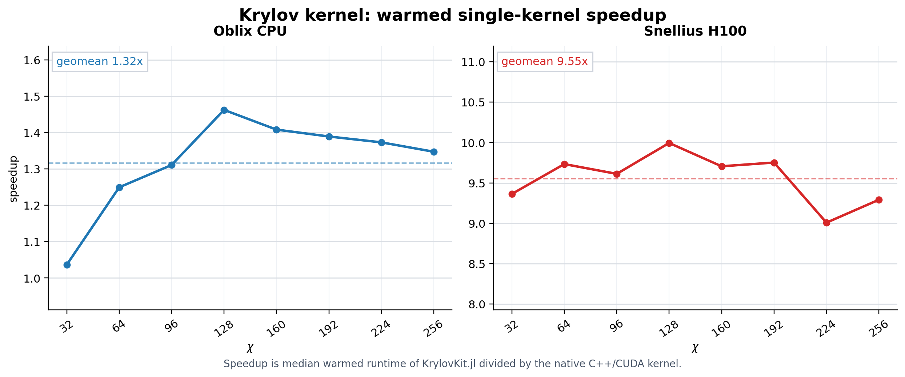
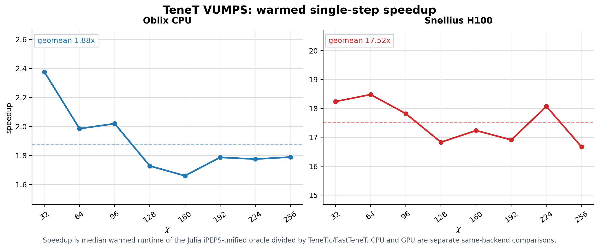

# C++ in Computational Physics in the Era of LLM Agentic Coding

High-performance computational physics has always faced a very practical tension: the clearest and most verifiable algorithms are often written in high-level languages such as Julia, while the fastest programs often need to be implemented in C++ and CUDA. The truly expensive part is not "writing code that runs"; it is maintaining a highly specialized, extremely difficult-to-extend, and extremely difficult-to-verify high-performance implementation. Specialized code is fast, but its cost is also very high.

In the era of LLM agentic coding, this cost structure is beginning to change.

In this experiment, we used Julia implementations as oracles. KrylovKit.jl and TeneT.jl define the algorithmic behavior, numerical outputs, and correctness boundaries; the LLM agent then worked around these oracles to replace key linear algebra and VUMPS paths with specialized C++/CUDA implementations. Every optimization had to be validated against the oracle: matching outputs, passing residual checks, CPU against CPU, and GPU against GPU.

The most important point here is not that one implementation "defeated" another. On the contrary, this work relies on these excellent Julia packages as reliable oracles. I especially thank Jutho for KrylovKit.jl and Xingyu Zhang for TeneT.jl. If you use the code here, please directly cite their packages.

What I find truly exciting is this: LLM agents go beyond helping us write code. They can participate in profiling, bottleneck localization, kernel rewriting, validation design, and repeated iteration under strict oracle constraints. Throughout the entire process, I did not manually write a single line of low-level implementation code; my role was to define the target, set the constraints, check correctness, and judge whether an optimization was genuinely meaningful.

This is crucial for computational physics. Physicists can devote more attention to algorithms, models, convergence, and physical interpretation, while reducing the long-term burden imposed by low-level implementation details. This is especially relevant on GPUs, where complex kernel cooperation, memory layout, and host/device scheduling are among the hardest parts to maintain; now they can be organized into a verifiable engineering optimization loop.

My view is direct: the two-language problem will not disappear immediately, but it will be redefined. High-level languages will be responsible for ideas and correctness, low-level languages will be responsible for performance, and the most painful migration and optimization steps in between will increasingly be carried out by LLM agents.
