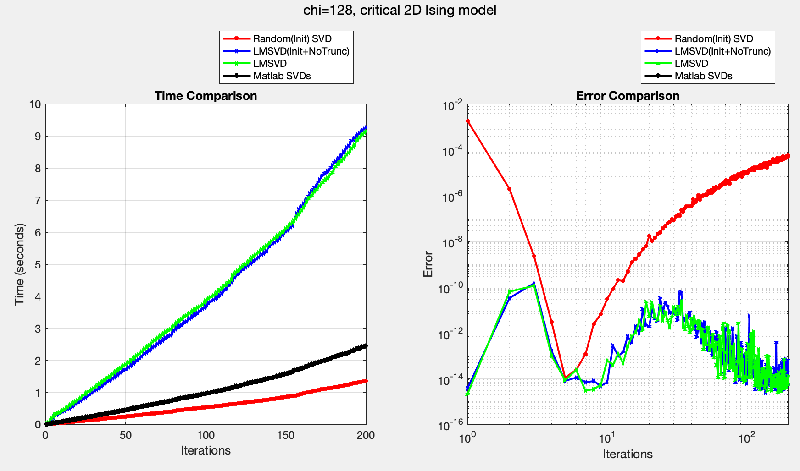

# LMSVD and Beyond

## Basics of LMSVD

LMSVD ([LIMITED MEMORY SVD](https://epubs.siam.org/doi/epdf/10.1137/120871328)) is a powerful solver for computing Singular Value Decompositions (SVDs) in tensor networks. It belongs to the family of truncated SVD algorithms, with the latest implementation available at the [LMSVD page](https://www.cmor-faculty.rice.edu/~zhang/LMSVD/lmsvd.html).

LMSVD achieves superior performance compared to traditional SVD solvers through two key innovations:

1. **Partially Reorthogonalization (PRO)**: This technique is derived from [PROPACK](http://sun.stanford.edu/~rmunk/PROPACK/), which optimizes the orthogonalization process.
2. **LOBPCG (Locally Optimal Block Preconditioned Conjugate Gradient)**: This method applies block optimization principles to solve the SVD subproblem, specifically finding the largest $k$ eigenvectors of $A^TA$ where $A=USV^\dagger$.

The combination of these techniques results in state-of-the-art performance for SVD computations.

## Advanced Applications in Tensor Networks

While LMSVD is already highly effective, there are opportunities for further optimization in tensor network applications. In tensor networks, we frequently need to compute low-rank approximations of tensors iteratively. Consider a scenario where we have $A_{i}=U_i S_i V_i^\dagger$, and we need to find a low-rank approximation of $A_{i+1}$, where $\|A_{i}-A_{i+1}\|$ is small. Here are two strategies to accelerate LMSVD in this context:

1. **Krylov Space Initialization**: We can initialize the Krylov space in LMSVD by setting the `initY` parameter. The optimal initialization can be proven to be $Y = V$.

2. **Guard Vector Recycling**: LMSVD uses "guard vectors" to ensure accuracy when computing the leading $k$ eigenvectors of $A^TA$. This requires constructing a $(k+g)$-dimensional Krylov space, where $g$ is the number of guard vectors. Instead of discarding these guard vectors after each iteration, we can preserve the enlarged $(k+g)$ Krylov space and use it to initialize the next iteration.

## Performance Benchmarks

### **Classical 2D Ising Model**

   An interesting observation is that LMSVD appears slower than MATLAB's SVD for this case. This is because the minimum number of required iterations is greater than 2, while the bulk tensor has only $D=2$. When truncating from $2\chi$ to $\chi$, any additional iterations beyond the necessary 2 become computational overhead. This suggests that larger $D$ values might show more favorable results.

   

### **Classical q=5 Vector Potts Model**

   The optimized LMSVD shows improved performance in this case, though the improvement is modest.

   

### **Random SVD Comparison**

   We also implemented a Random SVD approach, which uses initialization similar to Random SVDs but performs only one iteration. While this approach offers significantly faster computation times, it comes at the cost of reduced accuracy.

## Outlook

Several promising avenues for future research include:

1. Investigating the benefits of this initialization strategy for quantum bulk tensors.
2. Further optimization of LMSVD's core implementation, such as reducing the minimum iteration requirement (this would require modifications to the source code rather than API-level changes).